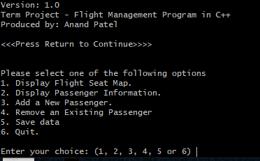
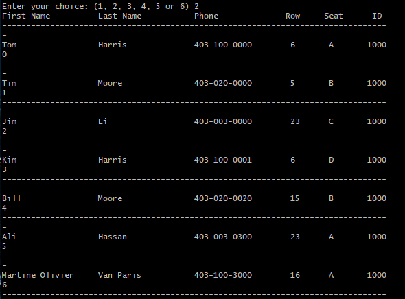
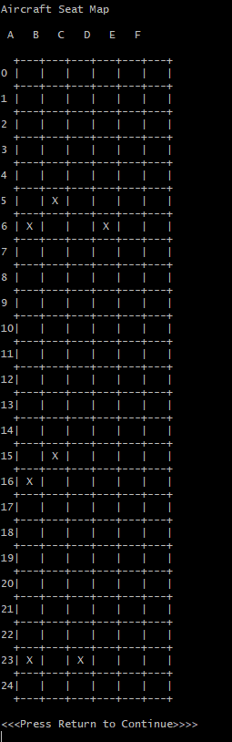

# Airplane-Reservation-System
This program was made for a final class project. It allows the user to read from a file "Flight" (assumes same format as example) and displays data corresponding to the file. Functionalities include: Display of Flight Map, Display Passenger Information, Addition & Removing Passengers, and Save data.

# Example

